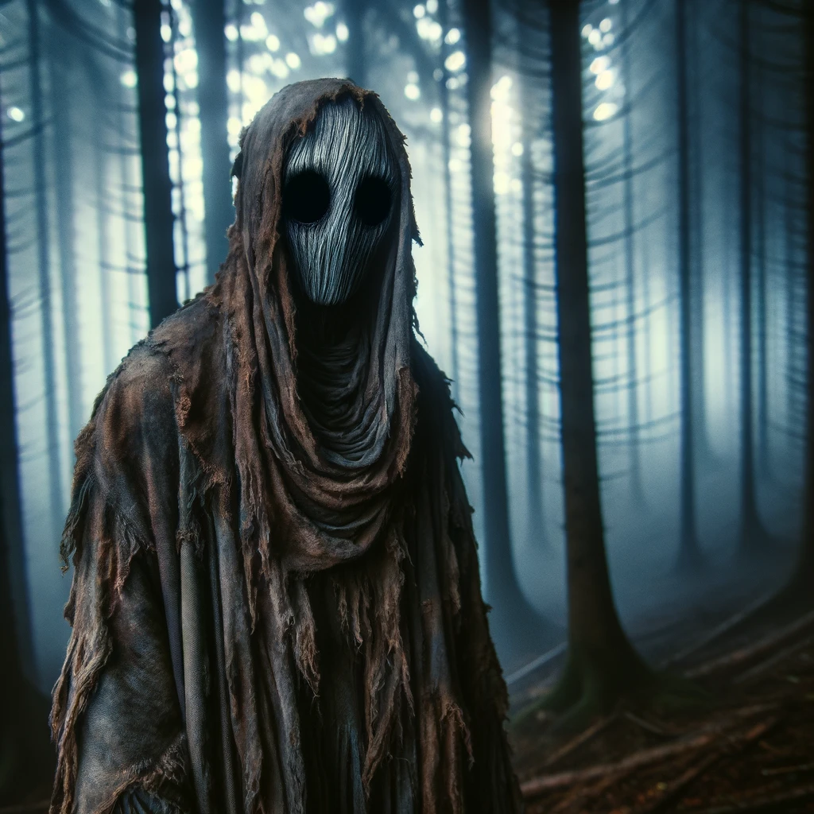

# The Hollow-Eyed Hunter

In the deep, shadowed woods of Bitterbrook, there stalks a legend as old and as mysterious as the town itself – the Hollow-Eyed Hunter. This enigmatic, spectral figure, with its haunting, empty gaze, has become a symbol of fear and intrigue among the townsfolk.

## A Terrifying Presence
The Hollow-Eyed Hunter is known for its ghastly appearance. The most striking feature, the dark voids where eyes should be, gives it an aura of otherworldly terror. Its very presence sends a shiver down the spine of those who dare venture into the woods after dusk.

## Whispers of Origin
The origins of the Hollow-Eyed Hunter are as varied as they are chilling:
- **Cursed by Knowledge:** Some say the Hunter was once a mortal, consumed by an unquenchable thirst for forbidden knowledge, ultimately transformed into this ghostly entity.
- **A Creature from Beyond:** Others believe the Hunter is an otherworldly being, drawn to the peculiar energies of Bitterbrook, a visitor from a realm beyond our understanding.
- **Souls of the Forest:** A lesser-known but equally intriguing theory suggests that the Hunter is not a single entity but a manifestation of the souls who met their end in Bitterbrook's forest. It is believed that these lost souls collectively form the Hunter, roaming the woods in a perpetual state of unrest.

## An Ominous Symbol
The appearance of the Hollow-Eyed Hunter is often regarded as an omen, intertwined with Bitterbrook's dark and mysterious past. Its presence is a foreboding sign, a reminder of the town's haunted history.

## A Dangerous Entity
Rumors swirl that the Hunter can be summoned for vengeance, but such acts come with great risks. To call upon the Hunter is to invite the unknown into one's life, a decision fraught with peril.

## A Cautionary Tale
For those who walk the forest paths of Bitterbrook, the Hollow-Eyed Hunter is a reminder of the unseen dangers that lurk in the shadows. Its power is formidable, its nature unknown, and its existence a puzzle that continues to mystify.

